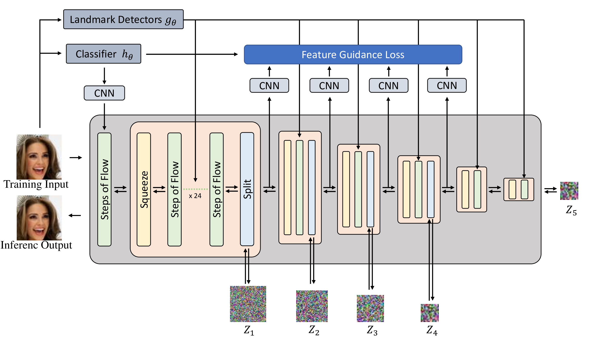

# pose-guided-flow

Implementation of "Improved Image Generation of Normalizing Flow with Semantic Feature Guidance" (TBA) in Pytorch

## Architecture

## Requirements

- CUDA 11.0
- Python 3.9
- PyTorch 1.11
- others : requirements.txt

> git clone https://github.com/dajinstory/feature-guided-flow.git  
> cd feature-guided-flow  
> pip install -r requirements.txt  

## Usage

### Preparing Dataset, Configs

For training, you need to prepare Dataset and meta file. Meta file for CelebA dataset are in data/{DATASET_NAME}/train_meta.csv. It only contains the file name of dataset.

Also you should edit config files. There are "*_path" named keys. Those keys contains root path of dataset, path of meta file and path to save log and checkpoint files.

### Training Model

You can train model from scratch,
> bash script/train_v0_fg_recon.sh  

### Demo

You can check the sampling result of the pretrained model by running src/demo.ipynb

If you want to utilize the FGFlow model for your personal research, you just need to refer to src/demo.ipynb, src/model/ and src/loss.

### Pretrained Checkpoints

I trained 64x64 models on CelebA dataset for ???? iterations. The model followed the setting from GLOW official paper. I got bpd(bits per dimension) about ??,  . I trained 64x64 model with 1 GPU, 16 mini-batch size on each GPU. 

|      HParam       |          FGFlow64x64V0          |
| ----------------- | ----------------------------- |
| input shape       | (64,64,3)                     |
| L                 | 4                             |
| K                 | 48                            |
| hidden_channels   | 512                           |
| flow_permutation  | invertible 1x1 conv           |
| flow_coupling     | affine                        |
| batch_size        | 64 on each GPU, with 1 GPUs   |
| y_condition       | false                         |

|     Model     |   Dataset   |                              Checkpoint                                     |          Note         |
| ------------- | ----------- | --------------------------------------------------------------------------- | --------------------- |
| FGFlow64x64V0   | CelebA      | [FGFlow64X64V0_CelebA](https://drive.google.com/file/d/1TScbx_tnDlvqaKxczgKhqgLoxzIEbk74/view?usp=sharing)  | 64x64 CelebA Dataset   |
| FGFlow256x256V0 | CelebA      | [FGFlow256X256V0_CelebA](TBA)  | 256x256 CelebA Dataset      |

## Samples

Generated samples. Left to right: Results by GLOW and Ours. We can see more details (e.g., hair, expression) in our results than in the GLOW baseline.

Result of z space interpolation. Up to down: Results by GLOW and Ours.

## Reference
https://github.com/dajinstory/glow-pytorch  

