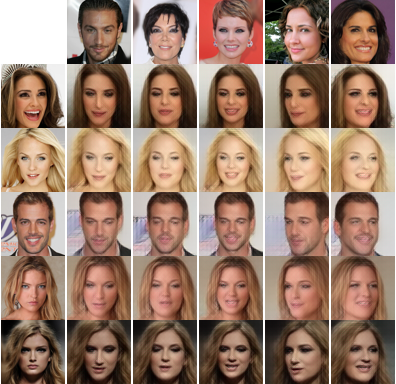

# Pose Guided Flow

Implementation of "Flow-based Pose Transfer Using 2D Gaussian Pose Map" (TBA) in Pytorch

## Architecture


## Requirements

- CUDA 11.0
- Python 3.9
- PyTorch 1.11
- others : requirements.txt

> git clone https://github.com/dajinstory/pose-guided-flow.git <br/>
> cd pose-guided-flow <br/>
> pip install -r requirements.txt <br/>

## Usage

### Preparing Dataset, Configs

For training, you need to prepare Dataset and meta file. You should download VoxCeleb2 dataset for training. Then, you should prepare the facial landmarks of VoxCeleb2. I used this [repo](https://github.com/cunjian/pytorch_face_landmark).  Meta file for VoxCeleb2 dataset are in data/{DATASET_NAME}/train_meta.csv. It only contains the file name of dataset. 

Also you should edit config files. There are "*_path" named keys. Those keys contains root path of dataset, path of meta file and path to save log and checkpoint files.

### Training Model

You can train model from scratch,
> CUDA_VISIBLE_DEVICES=0 python src/train.py --config config/pgflow_v3.yml <br/>

### Demo

You can check the sampling result of the pretrained model by running src/demo.ipynb

If you want to utilize the PGFlow model for your personal research, you just need to refer to src/demo.ipynb, src/model/ and src/loss.

### Pretrained Checkpoints

I trained 64x64 models on VoxCeleb2 dataset for ???? iterations. I trained 64x64 model with 4 GPU, 4 mini-batch size on each GPU. 

|      HParam       |          PGFlowV3             |
| ----------------- | ----------------------------- |
| input shape       | (64,64,3)                     |
| L                 | 7                             |
| K                 | 8-16                          |
| hidden_channels   | 512                           |
| flow_permutation  | invertible 1x1 conv           |
| flow_coupling     | affine                        |
| batch_size        | 4 on each GPU, with 4 GPUs    |
| y_condition       | false                         |

|     Model     |   Dataset   |                              Checkpoint                                     |          Note         |
| ------------- | ----------- | --------------------------------------------------------------------------- | --------------------- |
| PGFlowV3      | VoxCeleb2   | [PGFlowV3](TBA)         | 64x64 VoxCeleb Dataset   |
| PGFlow256x256 | VoxCeleb2   | [PGFlow256X256](TBA)    | 256x256 VoxCeleb Dataset      |

## Samples



Generated samples from 64x64 CelebA dataset. With only one reference source image input (the left column), our model can transfer pose to target (the top row).


## Reference
https://github.com/dajinstory/glow-pytorch <br/>
https://github.com/open-mmlab/mmgeneration/ <br/>
https://github.com/cunjian/pytorch_face_landmark <br/>

```
@software{NF-pytorch,
  author = {Dajin Han},
  title = {{Framework for Flow-based Model in Pytorch}},
  year = {2022},
  url = {http://github.com/dajinstory/glow-pytorch}
}

@misc{PFL,
  title={{PyTorch Face Landmark}: A Fast and Accurate Facial Landmark Detector},
  url={https://github.com/cunjian/pytorch_face_landmark},
  note={Open-source software available at https://github.com/cunjian/pytorch_face_landmark},
  author={Cunjian Chen},
  year={2021},
}
```